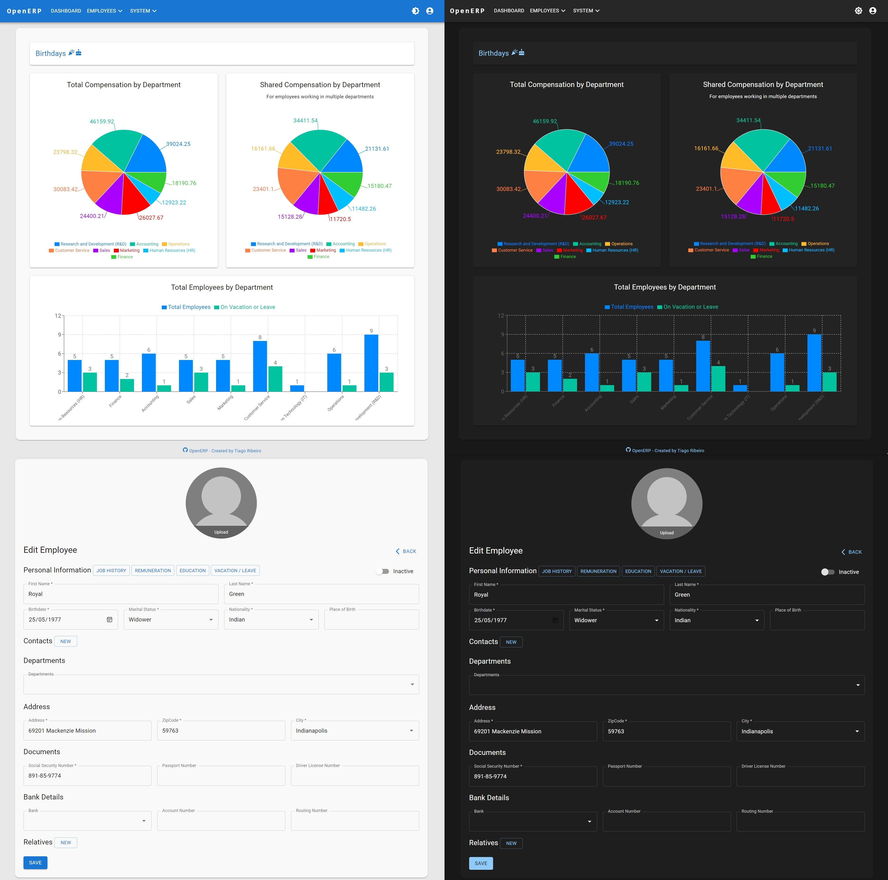

<h1 align="center">
    OpenERP
</h1>

<p align="center">
  

  

  
</p>



## Index
- About
- Main Technologies
- Documentation
- Starting the Project
  - Initial .NET Configuration
  - Database
  - Seeders and Fake Data
  - Starting .NET
  - Starting ReactJs
  - User and Admin Accounts
  - Logout
- New Features (Future Improvements)
- License

## 🏆 About

OpenERP is a study project aimed at putting into practice the knowledge acquired with the technologies used here. It aims to be open-source software to support the community and companies of all sizes, receiving new features, updates, and fixes as time permits to work on this project.

Features (summary):
- Human Resources Module;
  - Personal Information Management;
  - Professional Progression;
  - Salary History;
  - Educational / Course History;
  - Vacation / Leave History;
- Audit logs of all database operations;
- Login;
  - Token / Refresh Token;
  - Access Profiles (Work in Progress);
- Global;
  - Sectors;
  - Professions;
  - Companies;
  - Countries / States / Cities;
- Layout;
  - Light and Dark Themes;
  - Responsive System: PC / Laptop / Tablet / Mobile;

## 🧪 Main Technologies

- [.NET 8](https://dotnet.microsoft.com/en-us/download/dotnet/8.0)
- [SQL Server](https://www.microsoft.com/en-us/sql-server/sql-server-downloads)
- [ReactJS 18](https://reactjs.org)
- [TypeScript](https://www.typescriptlang.org/)
- [Material-UI](https://material-ui.com/)

## Documentation

Currently, the only available documentation is provided by Swagger and is accessible when you start the backend of the project.

## 🚀 Starting the Project

Make sure to properly install .NET 8 and NodeJS 20 to run this project.

```bash
# clone the project
git clone https://github.com/gonribeiro/OpenERP
```

### Initial .NET Configuration

Make a copy of the "appsettings.example.json" file and rename it to "appsettings.json".

If you start ReactJs at a different address, remember to change it in:

```json
// appsettings.json
{
  "AllowedOrigins": [
    "http://localhost:5173", // Change here
  ],
}
```

### Database

Note that the project has "LocalDB" defined as the default, which is a lightweight and simplified version of SQL Server, designed for developers.

If you choose to use it, make sure you have it installed. It is usually installed with Visual Studio but can be downloaded separately as part of the SQL Server Express package.

Or, use SQL Server by correctly changing the database information:

```json
// appsettings.json
{
  "ConnectionStrings": {
    //// LocalDB
    "DefaultConnection": "Server=(localdb)\\mssqllocaldb;Database=OpenERP;Trusted_Connection=True;MultipleActiveResultSets=true"
    //// SqlServer
    // "DefaultConnection": "Server=myServerAddress;Database=myDataBase;User Id=myUsername;Password=myPassword;"
  },
}
```

### Seeders and Fake Data

When starting the project for the first time, the system will register several records in the database. These entries are related to departments, institutions, countries, states, and cities, mostly registered in English.

If you do not want these records, in *OpenERP/back/Extensions/ApplicationBuilderExtensions*, comment out the following sections (however, keep those indicated below as you will need them to log in to the system):

```csharp
CountrySeeder.Seed(dbContext);
StateSeeder.Seed(dbContext);
CitySeeder.Seed(dbContext);
CompanySeeder.Seed(dbContext);
RoleSeeder.Seed(dbContext); // do not comment out Role
UserSeeder.Seed(dbContext); // do not comment out User
RoleUserSeeder.Seed(dbContext);
DepartmentSeeder.Seed(dbContext);
JobSeeder.Seed(dbContext);
```

Note also that the project has a fake data seeder used for manual screen testing. If you want to start the project with this information, uncomment the section:

```cs
//EmployeeFakeSeeder.Seed(dbContext);
```

### Starting .NET

Start the project:

```bash
# navigate to
cd OpenERP/back

# Install dependencies
dotnet restore

# Compile and check for errors
dotnet build

# Build the database
dotnet ef database update

# Start the development server
dotnet run
```

### Initial ReactJS Configuration

Make a copy of the ".env.development" file and rename it to ".env".

If you start .NET at a different address, remember to change it in:

```env
// .env
VITE_OPEN_ERP_API_URL='http://localhost:5094/v1/' // Change here
```

**Note: .NET is being started using HTTP, not HTTPS. If you start .NET using HTTPS, you may need to configure Vite to accept this type of connection with the backend.**

### Starting ReactJS

ReactJS was built using Vite. To start it, use the commands:

```bash
# navigate to
cd OpenERP/front

# Install dependencies
npm install
# or
yarn install

# Start the development server
npm run dev
# or
yarn dev
```

The application will be available for access in your browser at http://localhost:5173/ or at your preferred address.

### User and Admin Accounts

When accessing the web project, you will be asked to log in. Enter:

```
Use "A" uppercase.

Username: Admin
Password: Admin
```

After the first login, you will be required to change the password, which must contain:

- A minimum of 6 characters
- At least one uppercase letter
- One lowercase letter
- One number
- One special character (e.g., !?@$%&#.)

**Note: Except for the administrator, all other user accounts must have an associated employee (unless you register this account directly in the database).**

### Logout

- If you remain inactive in the system for two hours, you will be automatically logged out.
- After a period of 12 hours, the system will require you to log in again.
- If you log in to the system from another browser or device, your previous session will be terminated, resulting in loss of access.
- If the user account is deactivated or the associated employee is deactivated in the system (terminated from the institution), access to the system will be lost.

**Note:** The token has a duration of 15 minutes, so it may take this time for the session to expire completely.

## 🚴 New Features (Future Improvements)

The implementation of new features and various improvements in the system will be carried out as time allows.

However, it is possible to list desired features:

- Automated tests
- Document Module
- Training Module
- HelpDesk
- Building Maintenance Module
- Inventory Management Module (including chemicals)
- Financial Management Module
- Improvements in datatable filters (https://www.material-react-table.com/docs/examples/basic)

## 📝 License

This project is licensed under the MIT License. See the [LICENSE](LICENSE.md) file for more details.

---
<p align="center">OpenERP created by 💜 Tiago Ribeiro</p>


